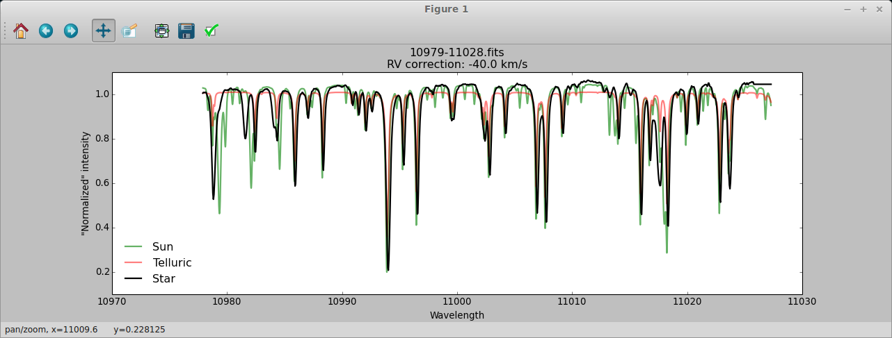

# Install
Try install many of the scripts with

    pip install astro-scripts

This is still under development though, but it does work!

To check the installation run `plot_fits` in the terminal.

# WARNING
Look at the wiki instead: https://github.com/DanielAndreasen/astro_scripts/wiki
It's not done, but I will gradually move documentation to the wiki.

Small tools for an astronomer
=============================

Small scripts to make my life easier.

The tools are mainly (if not exclusive) for spectroscopy. All the small scripts
are fairly well documented, and the python scripts use the module `argparse`
which means you can run them like

    python numpy2moog -h

and get some fancy help information on how to use them. The shell scripts have
a block comment in top of the file.

I recommend putting this folder in your PATH so the scripts are easily accesible. To do so depends on your system. I am sure [google](http://www.google.com) can help you ;)

## Dependencies
   * [Matplotlib](http://matplotlib.org/)
   * [Astropy](http://astropy.org)
   * [numpy](http://numpy.org)
   * [argparse](https://docs.python.org/3/library/argparse.html)
   * [PyAstronomy](http://www.hs.uni-hamburg.de/DE/Ins/Per/Czesla/PyA/PyA/index.html)

## plot_fits
This I find to be a very powerful and handy python script. It simply
plot a fits file and leave you in pan mode (matplotlib). More over it
has the feature to plot a part of the solar spectrum and telluric lines,
and finally redshift the spectrum.

For this script one needs to use the telluric and solar spectrum
provided here and change the path in `plot_fits` in line 46 and line 57.

The wavelength vector is created from the fits (which should be 1D). It uses
the keywords
   - CRVAL1: The beginning of the wavelength.
   - CDELT1: The step in wavelength.
   - NAXIS: The length of the wavelength vector.

## numpy2moog
This is a python script that converts ASCII arrays into the format for [MOOG](http://www.as.utexas.edu/~chris/moog.html]).
It can be a bit tricky, but I will provide examples in the future.

## VALDextraction
This script is used to send emails to `extract all` from the VALD database. A
central wavelength should be inputted with the `-h` flag, and the half range
should be given with the `-s` flag.

#### Example
    VALDextraction -w 6743 -s 3

This will open a new email (Thunderbird) with the syntax required for VALD (no
reason to delete the signature) in a 6Å window centered on the wavelength
6743Å.

## splotCommenter.sh
This one-liner I have saved in a script put a `#` on all the lines containing a `center` from a IRAF files after using
the `splot` routine. This allows to easy read the `splot.log` with python using something like `np.loadtxt`. One
probably need to remove date strings. This should be easy to implement I guess.

## VALDprepare.sh
This bash script unpack a linelist from [VALD](http://vald.astro.univie.ac.at/~vald3/php/vald.php) when the download
option is set to FTP. The downloadable file is `.gz`. This file is unpacked and saved in an optional `output` argument
(see the block comment in the script). The references is saved in a seperate file, and the final file is relatively
easy to read with `np.loadtxt`.

## CONTRIBUTE
Feel free to open an issue with suggestions or bugs.

## LICENCE
Read the LICENCE file.
